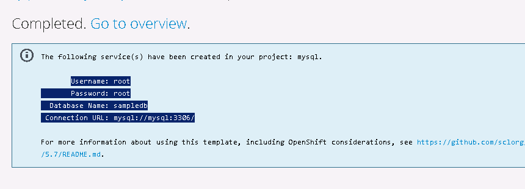

# openshift origin 3.6 部署 文档

# 系统环境：

CentOS Linux release 7.3.1611

主机配置：

内存8G  硬盘100G

# 系统安装

集群个节点 安装如下


时区 中国上海

分区
 
选择磁盘 选中 i will configure partitioning 选项  

下一界面 点击；

Click here to create them automatiaclly

删除home 分区

最终分区情况如下

/boot 1024 MiB

/     50GiB

swap  8064 MiB


最小化安装

设置主机名

```
hostnamectl  set-hostname  master-160.example.com

hostnamectl  set-hostname  node-161.example.com

hostnamectl  set-hostname  node-162.example.com

hostnamectl  set-hostname  node-163.example.com

hostnamectl  set-hostname  node-164.example.com
```

配置本地yum

配置网卡
删除uuid mac地址等信息，以便可以方便的进行克隆

ls | grep -v  CentOS-Base.repo | xargs  rm  -rf

vi  /etc/yum.repos.d/CentOS-Base.repo

```
# CentOS-Base.repo
#
# The mirror system uses the connecting IP address of the client and the
# update status of each mirror to pick mirrors that are updated to and
# geographically close to the client.  You should use this for CentOS updates
# unless you are manually picking other mirrors.
#
# If the mirrorlist= does not work for you, as a fall back you can try the 
# remarked out baseurl= line instead.
#
#

[base]
name=CentOS-$releasever - Base
baseurl=http://172.16.2.100/base
gpgcheck=1
gpgkey=file:///etc/pki/rpm-gpg/RPM-GPG-KEY-CentOS-7

#released updates 
[updates]
name=CentOS-$releasever - Updates
baseurl=http://172.16.2.100/updates
gpgcheck=1
gpgkey=file:///etc/pki/rpm-gpg/RPM-GPG-KEY-CentOS-7

#additional packages that may be useful
[extras]
name=CentOS-$releasever - Extras
baseurl=http://172.16.2.100/extras
gpgcheck=1
gpgkey=file:///etc/pki/rpm-gpg/RPM-GPG-KEY-CentOS-7

#additional packages that extend functionality of existing packages
[centosplus]
name=CentOS-$releasever - Plus
mirrorlist=http://mirrorlist.centos.org/?release=$releasever&arch=$basearch&repo=centosplus&infra=$infra
#baseurl=http://mirror.centos.org/centos/$releasever/centosplus/$basearch/
gpgcheck=1
enabled=0
gpgkey=file:///etc/pki/rpm-gpg/RPM-GPG-KEY-CentOS-7
```

yum clean all

yum install wget git net-tools bind-utils iptables-services bridge-utils bash-completion kexec-tools sos psacct

yum update


yum install docker-1.12.6

yum -y install ansible pyOpenSSL


配置openshift yum 源

```
vi /etc/yum.repos.d/openshift.repo

[etcd]
name=etcd
baseurl=http://172.16.2.21/yum/etcd
gpgcheck=0
enable=1

[op3.6]
name=op3.6
baseurl=http://172.16.2.21/yum/op3.6
gpgcheck=0
enable=1

[commrpm]
name=commrpm
baseurl=http://172.16.2.21/yum/comm
gpgcheck=0
enable=1
```


事先安装一些依赖：


yum   install cockpit-bridge cockpit-docker cockpit-system cockpit-ws  ceph-common flannel


设置docker 镜像仓库

sed -i '/OPTIONS=.*/c\OPTIONS="--selinux-enabled --insecure-registry 172.30.0.0/16"'   /etc/sysconfig/docker


设置docker  存储

fdisk  /dev/vda
```
Command (m for help): n
Partition type:
   p   primary (2 primary, 0 extended, 2 free)
   e   extended
Select (default p): p
Partition number (3,4, default 3):回车
First sector (123486208-209715199, default 123486208): 
Using default value 123486208
Last sector, +sectors or +size{K,M,G} (123486208-209715199, default 209715199): +10G
Partition 3 of type Linux and of size 10 GiB is set

Command (m for help): w
```

partprobe


pvcreate /dev/vda3

vgcreate c2 /dev/vda3

systemctl stop docker

vim   /usr/bin/docker-storage-setup
```
VG=c2
SETUP_LVM_THIN_POOL=yes
```


lvmconf   --disable-cluster

docker-storage-setup

systemctl  start docker

systemctl  enable docker


# 为glusterfs 配置存储块设备

创建第一个块设备

fdisk  /dev/vda

Command (m for help): n

Select (default e): e

Selected partition 4

First sector (144457728-209715199, default 144457728): 回车

Last sector, +sectors or +size{K,M,G} (144457728-209715199, default 209715199): +15G

Using default value 209715199

Partition 4 of type Linux and of size 31.1 GiB is set


Command (m for help): w


partprobe

创建第二个块设备

fdisk  /dev/vda

Command (m for help): n

All primary partitions are in use

Adding logical partition 5

First sector (144459776-175915007, default 144459776): 

Using default value 144459776

Last sector, +sectors or +size{K,M,G} (144459776-175915007, default 175915007): +12G    

Partition 5 of type Linux and of size 12 GiB is set

Command (m for help): w  

The partition table has been altered!

partprobe


# 禁用ansible  自动配置yum

```
>  /root/openshift-ansible-release-3.6/roles/openshift_repos/files/origin/repos/openshift-ansible-centos-paas-sig.repo
```


# ansible 清单文件如下

cat /etc/ansible/hosts 

```
[OSEv3:children]
masters
nodes
etcd
glusterfs

[OSEv3:vars]

ansible_ssh_user=root
openshift_storage_glusterfs_namespace=glusterfs 
openshift_storage_glusterfs_name=storage 

ansible_become=true

openshift_deployment_type=origin

openshift_disable_check=memory_availability,disk_availability,docker_storage,docker_image_availability


openshift_master_identity_providers=[{'name': 'htpasswd_auth', 'login': 'true', 'challenge': 'true', 'kind': 'HTPasswdPasswordIdentityProvider', 'filename': '/etc/origin/master/htpasswd'}]

[masters]
master-160.example.com

[etcd]
master-160.example.com

[nodes]
node-161.example.com    
node-162.example.com   
node-163.example.com    
node-164.example.com    openshift_schedulable=True   openshift_node_labels="{'region': 'infra', 'zone': 'default'}"

[glusterfs]
node-161.example.com   glusterfs_ip=172.16.2.161   glusterfs_devices='[ "/dev/vda4", "/dev/vda5" ]'
node-162.example.com   glusterfs_ip=172.16.2.162   glusterfs_devices='[ "/dev/vda4", "/dev/vda5" ]'
node-163.example.com   glusterfs_ip=172.16.2.163   glusterfs_devices='[ "/dev/vda4", "/dev/vda5" ]'
```

# 配置DNS 服务器

DNS  服务器地址

172.16.2.21


三台服务器 域名规划如下

master-160.example.com

node-161.example.com

node-162.example.com


# NTP  服务器

echo '/usr/sbin/ntpdate 172.16.2.21'   >>   /etc/rc.local

yum -y install ntpdate


# 配置 ssh  key

```
 ssh-keygen -f ~/.ssh/id_rsa -N ''
 

 for host in  master-160.example.com    node-161.example.com    node-162.example.com node-163.example.com node-164.example.com;  do  ssh-copy-id -i ~/.ssh/id_rsa.pub $host;  done
```
#  导入 基础 image

cd /root/op3.6-images/

docker load -i    hello-openshift.latest.tar

docker load -i    kubernetes.latest.tar  

docker load -i    origin-deployer3.6.0.tar  

docker load -i    origin-docker-registry.3.6.0.tar  

docker load -i    origin-haproxy-router.3.6.0.tar  

docker load -i    origin-pod.3.6.0.tar

docker load -i    origin-sti-builder.3.6.0.tar

docker load -i    gluster-centos.tar

docker load -i    heketi.tar

docker load -i heketi-dev.tar 

docker load -i origin-service-catalog.tar

# 执行 ansible  开始安装


yum -y install etcd 

systemctl start etcd


yum install glusterfs-fuse


ansible-playbook -i /etc/ansible/hosts   /root/openshift-ansible-release-3.6/playbooks/byo/config.yml 


failed: [master-160.example.com] (item=master-160.example.com) => {"failed": true, "item": "master-160.example.com", "msg": {"cmd": "/usr/bin/oc label node master-160.example.com glusterfs=storage-host --overwrite", "results": {}, "returncode": 1, "stderr": "Error from server (NotFound): nodes \"master-160.example.com\" not found\n", "stdout": ""}}


手动执行命令

oc label node master-160.example.com glusterfs=storage-host --overwrite


Error from server (NotFound): nodes "master-160.example.com" not found


gluster/gluster-centos:latest


oc  policy  add-role-to-user  admin  dev   -n  default

oc  policy  add-role-to-user  admin  dev   -n  openshift

oc  policy  add-role-to-user  admin  dev   -n  glusterfs


htpasswd -b /etc/origin/master/htpasswd dev dev


oc login -u system:admin


git clone https://github.com/openshift/openshift-ansible.git

>  /root/openshift-ansible/roles/openshift_repos/templates/CentOS-OpenShift-Origin36.repo.j2

ansible-playbook -i /etc/ansible/hosts   /root/openshift-ansible/playbooks/byo/config.yml 


卸载：

ansible-playbook -i /etc/ansible/hosts   /root/openshift-ansible-release-3.6/playbooks/adhoc/uninstall.yml

# success playbook

```
[OSEv3:children]
masters
nodes
etcd
glusterfs

[OSEv3:vars]

ansible_ssh_user=root


ansible_become=true

openshift_deployment_type=origin
openshift_version=3.6.0
openshift_storage_glusterfs_namespace=glusterfs 
openshift_storage_glusterfs_name=storage
openshift_disable_check=memory_availability,disk_availability,docker_storage,docker_image_availability


openshift_master_identity_providers=[{'name': 'htpasswd_auth', 'login': 'true', 'challenge': 'true', 'kind': 'HTPasswdPasswordIdentityProvider', 'filename': '/etc/origin/master/htpasswd'}]

[masters]
master-161.example.com

[etcd]
master-161.example.com

[nodes]
node-165.example.com  openshift_schedulable=True  openshift_node_labels="{'region': 'infra', 'zone': 'default'}"
node-162.example.com
node-163.example.com
node-164.example.com
[glusterfs]
node-162.example.com     glusterfs_ip=172.16.10.162   glusterfs_devices='[ "/dev/sda5" ]'
node-163.example.com     glusterfs_ip=172.16.10.163   glusterfs_devices='[ "/dev/sda5" ]'
node-164.example.com     glusterfs_ip=172.16.10.164   glusterfs_devices='[ "/dev/sda5" ]'
```


# GlusterFS

oc project glusterfs

查看 Gluster Endpoints

oc get endpoints 

heketi-db-storage-endpoints   172.16.10.162:1,172.16.10.163:1,172.16.10.164:1   1d

oc get endpoints  heketi-db-storage-endpoints  -o yaml

apiVersion: v1

kind: Endpoints

metadata:

  creationTimestamp: 2017-11-03T16:39:18Z
  name: heketi-db-storage-endpoints
  namespace: glusterfs
  resourceVersion: "2264"
  selfLink: /api/v1/namespaces/glusterfs/endpoints/heketi-db-storage-endpoints
  uid: 8964a176-c0b5-11e7-8a0a-000c298f426c
subsets:
- addresses:
  - ip: 172.16.10.162
  - ip: 172.16.10.163
  - ip: 172.16.10.164
  ports:
  - port: 1
    protocol: TCP


创建pv


cat pv.yaml 
```
apiVersion: v1
kind: PersistentVolume
metadata:
  name: gluster-default-volume 
spec:
  capacity:
    storage: 2Gi 
  accessModes: 
    - ReadWriteMany
  glusterfs: 
    endpoints: heketi-db-storage-endpoints 
    path: myVol1 
    readOnly: false
  persistentVolumeReclaimPolicy: Retain 
```

创建pvc

```
cat gluster-claim.yaml 

apiVersion: v1
kind: PersistentVolumeClaim
metadata:
  name: gluster-claim
spec:
  accessModes:
  - ReadWriteMany 
  resources:
     requests:
       storage: 1Gi 
```


确认pv和 pvc  状态都是bound

oc get pv

NAME                     CAPACITY   ACCESSMODES   RECLAIMPOLICY   STATUS    CLAIM                     STORAGECLASS   

REASON    AGE

gluster-default-volume   2Gi        RWX           Retain          Bound     glusterfs/gluster-claim                            12m


oc get pvc

NAME            STATUS    VOLUME                   CAPACITY   ACCESSMODES   STORAGECLASS   AGE

gluster-claim   Bound     gluster-default-volume   2Gi        RWX                          11m


## 持久化镜像仓库
```
oc project default

oc get pod

docker-registry-1-m8tkm

oc get dc


oc volumes dc/docker-registry --all

deploymentconfigs/docker-registry

  empty directory as registry-storage

    mounted at /registry

  secret/registry-certificates as registry-certificates

    mounted at /etc/secrets
```


查看当前挂载的本地目录使用大小情况

oc rsh  docker-registry-1-m8tkm  'du' '-sh'  '/registry'

0	/registry

当前 并未使用任何空间

如果已经存在数据 可以通过以下方式进行备份

mkdir  /root/backup

cd /root/backup/


oc rsync  docker-registry-1-m8tkm:/registry .


创建 pv

cat registry_pv.yaml 

apiVersion: v1
kind: PersistentVolume
metadata:
  name: registry-volume 
spec:
  capacity:
    storage: 5Gi 
  accessModes: 
    - ReadWriteMany
  glusterfs: 
    endpoints: heketi-db-storage-endpoints 
    path: registry 
    readOnly: false
  persistentVolumeReclaimPolicy: Retain 


oc create -f registry_pv.yaml


查看pv  状态   Available  即为可用


oc get pv

NAME                     CAPACITY   ACCESSMODES   RECLAIMPOLICY   STATUS 

registry-volume          5Gi        RWX           Retain          Available 


创建pvc

cat registry_pvc.yaml 

apiVersion: v1
kind: PersistentVolumeClaim
metadata:
  name: docker-registry-claim
spec:
  accessModes:
  - ReadWriteMany 
  resources:
     requests:
       storage: 5Gi 


oc create  -f registry_pvc.yaml

oc get pvc   状态为 Bound

NAME                    STATUS    VOLUME            CAPACITY   ACCESSMODES   STORAGECLASS   AGE

docker-registry-claim   Bound     registry-volume   5Gi        RWX                          6s


关联持久化请求

为registry 的容器添加持久化卷请求 docker-registry-claim

并与挂载点 registry-storage  关联


oc volumes  dc/docker-registry  --add --name=registry-storage -t pvc --claim-name=docker-registry-claim --overwrite deploymentconfigs/docker-registry

deploymentconfig "docker-registry" updated

deploymentconfig "docker-registry" updated


再次查看registry 的数据卷信息


oc volumes dc/docker-registry --all
deploymentconfigs/docker-registry
  pvc/docker-registry-claim (allocated 5GiB) as registry-storage
    mounted at /registry
  secret/registry-certificates as registry-certificates
    mounted at /etc/secrets


报错信息

```
Unable to mount volumes for pod "docker-registry-2-hg798_default(d47a229f-c22b-11e7-a4fa-000c298f426c)": timeout expired waiting for volumes to attach/mount for pod "default"/"docker-registry-2-hg798". list of unattached/unmounted volumes=[registry-storage]
```


oc delete pod docker-registry-1-m8tkm


# 对 registry 存储的操作有误如何修复 


oc edit  dc docker-registry


修改为如下


volumes:
      - emptyDir: {}
        name: registry-storage
      - name: registry-certificates
        secret:
          defaultMode: 420
          secretName: registry-certificates


# 为 mysql 配置 持久存储


使用mysql 持续存储模板创建应用
```
oc get pvc -o yaml
apiVersion: v1
items:
- apiVersion: v1
  kind: PersistentVolumeClaim
  metadata:
    creationTimestamp: 2017-11-08T05:35:03Z
    labels:
      app: mysql-persistent
      template: mysql-persistent-template
    name: mysql
    namespace: mysql
    resourceVersion: "93187"
    selfLink: /api/v1/namespaces/mysql/persistentvolumeclaims/mysql
    uid: 92448c96-c446-11e7-972c-52540011feca
  spec:
    accessModes:
    - ReadWriteOnce
    resources:
      requests:
        storage: 1Gi
  status:
    phase: Pending
kind: List
metadata: {}
resourceVersion: ""
selfLink: ""
```


报错信息

```
no persistent volumes available for this claim and no storage class is set
```


修改  mysql-persistent

oc edit template mysql-persistent -n openshift


```
kind: PersistentVolumeClaim
  metadata:
    annotations:
      olume.beta.kubernetes.io/storage-provisioner: kubernetes.io/glusterfs
      volume.beta.kubernetes.io/storage-class: glusterfs-storage
    name: ${DATABASE_SERVICE_NAME}
```

```
报错信息

MountVolume.SetUp failed for volume "kubernetes.io/secret/d6499aa0-c452-11e7-972c-52540011feca-deployer-token-5z6gr" (spec.Name: "deployer-token-5z6gr") pod "d6499aa0-c452-11e7-972c-52540011feca" (UID: "d6499aa0-c452-11e7-972c-52540011feca") with: secret "test"/"deployer-token-5z6gr" not registered
```

```
报错信息

Readiness probe failed: sh: cannot set terminal process group (-1): Inappropriate ioctl for device sh: no job control in this shell ERROR 2003 (HY000): Can't connect to MySQL server on '127.0.0.1' (111) 
```

Username: root Password: root Database Name: sampledb Connection URL: mysql://mysql:3306/ 



测试 mysql

查看数据卷大小
```
oc volumes dc/mysql --all -n mysql-t
deploymentconfigs/mysql
  pvc/mysql (allocated 1GiB) as mysql-data
    mounted at /var/lib/mysql/data
    
    
oc rsh mysql-1-33nc1  'du' '-sh' '/var/lib/mysql/data'
189M	/var/lib/mysql/data


oc rsh mysql-1-33nc1  'df' '-h'

```

登陆mysql  写入数据
```
oc rsh  mysql-1-33nc1 


普通用户登录
mysql -uuser -h mysql.mysql-t.svc -puser

root  用户登录

mysql -uroot -h mysql.mysql-t.svc -proot

show databases;

use sampledb; 


create table tutorials_tbl(
   tutorial_id INT NOT NULL AUTO_INCREMENT,
   tutorial_title VARCHAR(100) NOT NULL,
   tutorial_author VARCHAR(40) NOT NULL,
   submission_date DATE,
   PRIMARY KEY ( tutorial_id )
);

```

#### 制作一个镜像 用于mysql的客户端 以便测试 mysql 服务器
```
设置使docker 容器可以连接外部网络

echo "net.ipv4.ip_forward=1" >> /etc/sysctl.conf

sysctl  -p


mkdir test

cd test

cat Dockerfile 
FROM docker.io/centos:latest

RUN touch /tmp/test && \

yum -y install mysql

CMD tail -f /tmp/test


Docker build -t mytest .

为新镜像打上标签 并推送至私有registry

docker tag mytest 172.16.2.31:5000/mytest:latest

docker push 172.16.2.31:5000/mytest:latest

openshift  master 将镜像 导入 为 is


oc import-image  172.16.2.31:5000/mytest:latest   -n openshift --confirm --insecure


web console  部署 这个 is

进入容器内部 测试连接 mysql 服务器

oc rsh  mytest-1-pxcmd 


mysql -uroot -h mysql.mysql-t.svc -proot


show databases;
```


#### 测试删除mysql  pod 数据是否都在

```
oc delete pod mysql-1-33nc1

之后会自动生成一个pod
oc get pod | grep mysql
mysql-1-klvk3         1/1       Running   0          33s

在上一步的 客户端容器内查看

oc project test-mysql

oc rsh  mytest-1-pxcmd 

mysql -uroot -h mysql.mysql-t.svc -proot

show databases;

数据都在


```

#  在web console 使用持久存储  应用于 mysql


创建一个 pvc

Persistent Volume Claims


新建project  test1  web 页面点击 storage

点击 create storage

选中 之前创建的 gluster-storage 


Name  自定义

mysql

Access Mode  Single User 

Size

1 G


Create 


volumes:
        - name: mysql-data
          persistentVolumeClaim:
            claimName: mysql


```
Unable to mount volumes for pod "mysql-1-cfbdq_test1(edc9376a-c239-11e7-a4fa-000c298f426c)": timeout expired waiting for volumes to attach/mount for pod "test1"/"mysql-1-cfbdq". list of unattached/unmounted volumes=[mysql-data]
2 times in the last 
```

```
SchedulerPredicates failed due to PersistentVolumeClaim is not bound: "mysql", which is unexpected. (repeated 4 times)
```

```
no persistent volumes available for this claim and no storage class is set


```

```
Failed to provision volume with StorageClass "glusterfs-storage": glusterfs: create volume err: error creating volume Post http://heketi-storage-glusterfs.router.default.svc.cluster.local/volumes: dial tcp: lookup heketi-storage-glusterfs.router.default.svc.cluster.local: no such host.
```


```
oc get dc/mysql -o yaml

volumes:
      - name: mysql-data
        persistentVolumeClaim:
          claimName: mysql

```


```
报错信息

TASK [openshift_service_catalog : Label master-160.example.com for APIServer and controller deployment] *****************************************
fatal: [master-160.example.com]: FAILED! => {"changed": false, "failed": true, "msg": {"cmd": "/usr/bin/oc label node master-160.example.com openshift-infra=apiserver --overwrite", "results": {}, "returncode": 1, "stderr": "Error from server (NotFound): nodes \"master-160.example.com\" not found\n", "stdout": ""}}
	to retry, use: --limit @/root/openshift-ansible/playbooks/byo/config.retry


oc label node master-160.example.com  openshift-infra=apiserver --overwrite

```


#  Success install a cluster  and  don't Manual start etcd 

```
[OSEv3:children]
masters
nodes
etcd

[OSEv3:vars]

ansible_ssh_user=root


ansible_become=true

openshift_deployment_type=origin
openshift_version=3.6.0
openshift_disable_check=memory_availability,disk_availability,docker_storage,docker_image_availability


openshift_master_identity_providers=[{'name': 'htpasswd_auth', 'login': 'true', 'challenge': 'true', 'kind': 'HTPasswdPasswordIdentityProvider', 'filename': '/etc/origin/master/htpasswd'}]

[masters]
master-160.example.com

[etcd]
master-160.example.com

[nodes]
node-161.example.com  openshift_schedulable=True  openshift_node_labels="{'region': 'infra', 'zone': 'default'}"
node-162.example.com  openshift_schedulable=True  openshift_node_labels="{'region': 'infra', 'zone': 'default'}"
```

ansible-playbook -i /etc/ansible/hosts /root/openshift-ansible-release-3.6/playbooks/byo/config.yml


# TEST

```
[OSEv3:children]
masters
nodes
etcd
glusterfs
[OSEv3:vars]
ansible_ssh_user=root
ansible_become=true
openshift_deployment_type=origin
openshift_version=3.6.0
openshift_storage_glusterfs_namespace=glusterfs 
openshift_storage_glusterfs_name=storage
openshift_disable_check=memory_availability,disk_availability,docker_storage,docker_image_availability
openshift_master_identity_providers=[{'name': 'htpasswd_auth', 'login': 'true', 'challenge': 'true', 'kind': 'HTPasswdPasswordIdentityProvider', 'filename': '/etc/origin/master/htpasswd'}]

[masters]
master-161.example.com
[etcd]
master-161.example.com
[nodes]
master-161.example.com
node-165.example.com  openshift_schedulable=True  openshift_node_labels="{'region': 'infra', 'zone': 'default'}"
node-162.example.com
node-163.example.com
node-164.example.com
[glusterfs]
node-162.example.com     glusterfs_ip=172.16.10.162   glusterfs_devices='[ "/dev/sda5" ]'
node-163.example.com     glusterfs_ip=172.16.10.163   glusterfs_devices='[ "/dev/sda5" ]'
node-164.example.com     glusterfs_ip=172.16.10.164   glusterfs_devices='[ "/dev/sda5" ]'
```

docker load -i heketi-dev.tar 

docker load -i origin-service-catalog.tar


docker  pull docker.io/openshift/origin-service-catalog


git clone https://github.com/openshift/openshift-ansible.git

cd /root/openshift-ansible/roles/openshift_repos/templates/

\> CentOS-OpenShift-Origin14.repo.j2 

\> CentOS-OpenShift-Origin15.repo.j2 

\> CentOS-OpenShift-Origin36.repo.j2 

\> CentOS-OpenShift-Origin.repo.j2 


ansible-playbook -i /etc/ansible/hosts /root/openshift-ansible/playbooks/byo/config.yml


output
```
PLAY RECAP *******************************************************************************************************************************************************************************************************
localhost                  : ok=13   changed=0    unreachable=0    failed=0   
master-161.example.com     : ok=587  changed=120  unreachable=0    failed=0   
node-162.example.com       : ok=174  changed=14   unreachable=0    failed=0   
node-163.example.com       : ok=174  changed=14   unreachable=0    failed=0   
node-164.example.com       : ok=174  changed=14   unreachable=0    failed=0   
node-165.example.com       : ok=170  changed=13   unreachable=0    failed=0   


INSTALLER STATUS *************************************************************************************************************************************************************************************************
Initialization             : Complete
Health Check               : Complete
etcd Install               : Complete
Master Install             : Complete
Master Additional Install  : Complete
Node Install               : Complete
GlusterFS Install          : Complete
Hosted Install             : Complete
Service Catalog Install    : Complete
```


# success but  systemctl restart  origin-master   output  Failed to restart origin-master.service: Unit is masked.
```
[OSEv3:children]
masters
nodes
etcd
glusterfs
[OSEv3:vars]
openshift_enable_service_catalog=false
ansible_ssh_user=root
ansible_become=true
openshift_deployment_type=origin
openshift_version=3.6.0
openshift_storage_glusterfs_namespace=glusterfs 
openshift_storage_glusterfs_name=storage
openshift_disable_check=memory_availability,disk_availability,docker_storage,docker_image_availability
openshift_master_identity_providers=[{'name': 'htpasswd_auth', 'login': 'true', 'challenge': 'true', 'kind': 'HTPasswdPasswordIdentityProvider', 'filename': '/etc/origin/master/htpasswd'}]

[masters]
master-160.example.com
[etcd]
master-160.example.com
[nodes]
master-160.example.com
node-161.example.com  openshift_schedulable=True  openshift_node_labels="{'region': 'infra', 'zone': 'default'}"
node-162.example.com
node-163.example.com
node-164.example.com
[glusterfs]
node-162.example.com     glusterfs_ip=172.16.2.162   glusterfs_devices='[ "/dev/vda5" ]'
node-163.example.com     glusterfs_ip=172.16.2.163   glusterfs_devices='[ "/dev/vda5" ]'
node-164.example.com     glusterfs_ip=172.16.2.164   glusterfs_devices='[ "/dev/vda5" ]'
```

hostname -f


### 动态扩容卷


自己试验内容

先看下库的内容

MySQL [sampledb]> select * from sampledb.testtb;
+----+------+------+
| id | name | age  |
+----+------+------+
|  1 | aa   |   12 |
+----+------+------+


oc edit pv pvc-c526a5d4-c45a-11e7-972c-52540011feca 

更改大小


capacity:
    storage: 5Gi


oc replace | oc get pv -o yaml

oc replace | oc get pv  pvc-c526a5d4-c45a-11e7-972c-52540011feca  -o yaml


再次查库 最好重新登录

MySQL [sampledb]> select * from sampledb.testtb;
+----+------+------+
| id | name | age  |
+----+------+------+
|  1 | aa   |   12 |
+----+------+------+


查看 mysql 容器 挂载卷的大小

oc rsh mysql-1-33nc1  'df' '-h'


oc rsh  mysql-1-klvk3   'df' '-h'
Filesystem                                                                                          Size  Used Avail Use% Mounted on
/dev/mapper/docker-253:0-67836054-dc018f37f49bffbbef322d837921b152ddb2452c68ead0cd37784842b1f59752   10G  437M  9.6G   5% /
tmpfs                                                                                               3.9G     0  3.9G   0% /dev
tmpfs                                                                                               3.9G     0  3.9G   0% /sys/fs/cgroup
/dev/mapper/cl-root                                                                                  50G  8.3G   42G  17% /etc/hosts
shm                                                                                                  64M     0   64M   0% /dev/shm
172.16.2.162:vol_90c0d59eeffb2dac420fe630334fcac1                                                  1016M  223M  793M  22% /var/lib/mysql/data
tmpfs                                                                                               3.9G   16K  3.9G   1% /run/secrets/kubernetes.io/serviceaccount


显示还是1G


存储后台   需要扩容 

文档链接

https://blog.openshift.com/container-native-storage-for-the-openshift-masses/

172.16.2.162:vol_90c0d59eeffb2dac420fe630334fcac1 

heketi-cli volume expand --volume=0e8a8adc936cd40c2df3698b2f06bba9 --expand-size=2
    

oc rsh heketi-storage-1-7h38q 


